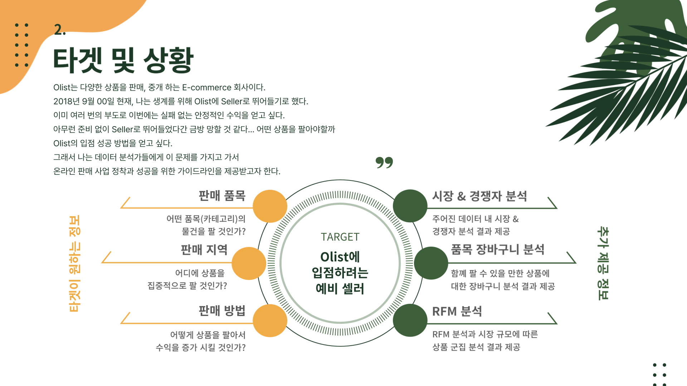
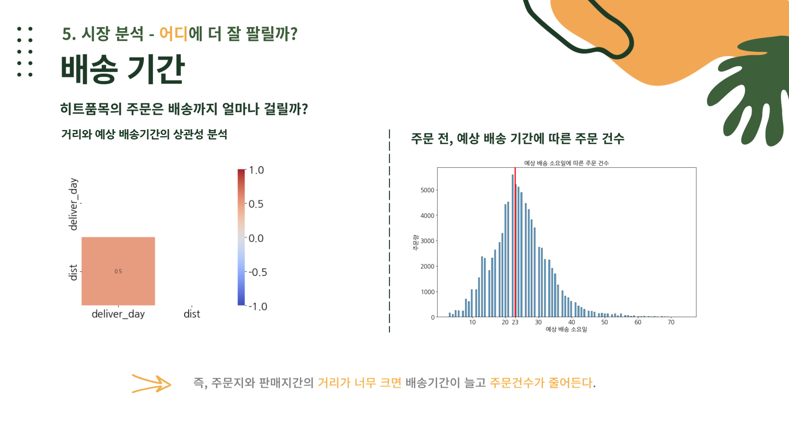
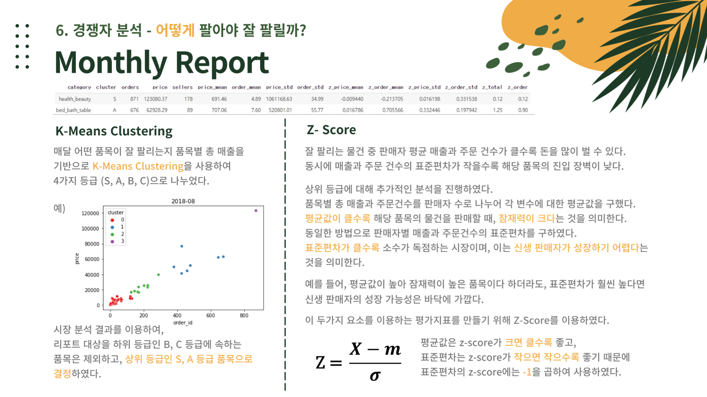
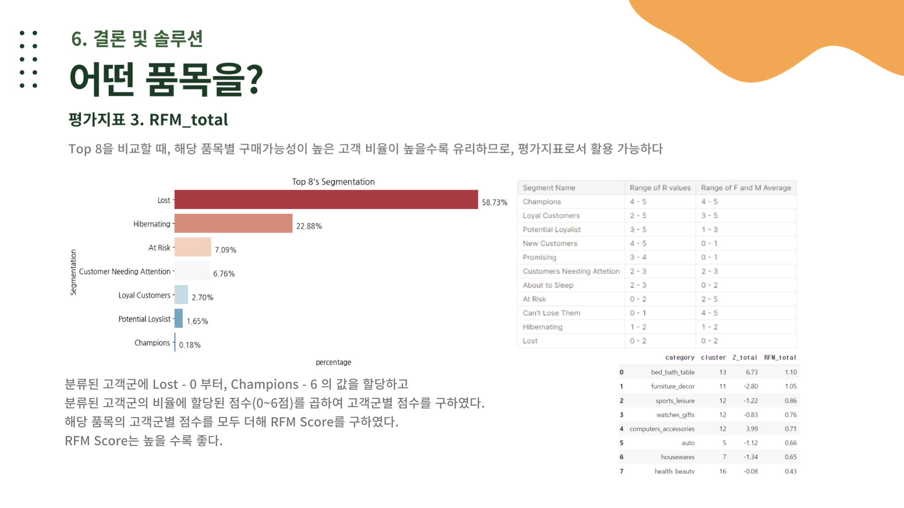

# LIKELION AIS7 DATATHON 


## 멋쟁이사자처럼AIS 제 7회 데이터톤 
### 🥉구운자현 - Olist에서 SELLER로 살아남기 👊
**📌 활용 데이터** : [Kaggle | Brazilian E-Commerce Public Dataset by Olist](https://www.kaggle.com/datasets/olistbr/brazilian-ecommerce)    
**📌 대회 주제** : 🌏 **Olist 온라인 쇼핑몰 데이터를 활용**하여 ```비즈니스적 가치``` 창출하기      
**📌 대회 기간** : 2023-01-09 ~ 2023-01-12

#### 🦁 구운자현 팀 소개
| 7️⃣🦁 | 7️⃣🦁 | 7️⃣🦁 | 7️⃣🦁 | 7️⃣🦁 |
| :---: | :---: | :---: | :---: | :---: |
| 이정은 | 구자현 | 문영운 | 박혜민 | 이승후 |

---
## 프로젝트 설명 
> Olist 온라인 쇼핑몰 입점을 원하는 예비 판매자 (SELLER) 를 위한 판매 물품 선정 가이드라인 👊

### 🤔타겟 및 상황 설정

📌 **Target :** Olist 에 뛰어들려는 예비 **`Seller`**

<br/>

📝 **현재 타겟이 처한 문제 상황**

```python
Olist는 다양한 상품을 판매, 중개 하는 E-commerce 회사이다.
2018년 9월 00일 현재, 나는 생계를 위해 Olist에 Seller로 뛰어들기로 했다. 
이미 여러 번의 부도로 이번에는 실패 없는 안정적인 수익을 얻고 싶다. 
아무런 준비 없이 Seller로 뛰어들었다간 금방 망할 것 같다... 
어떤 상품을 팔아야할까 ?

Olist 입점 성공 방법을 얻고 싶다.
그래서 나는 데이터 분석가들에게 이 문제를 가지고 가서
온라인 판매 사업 정착과 성공을 위한 가이드라인을 제공받고자 한다.
```


<br/>

> **❓분석 가설 설정**

온라인 매장에 입점 하고 싶은 예비 셀러를 위해 우리는 Olist 시장과 다른 Seller들의 특성에 대해 파악한 후 판매 품목을 선정하기 위한 가이드라인을 제시하고자 한다. 

`어떤?` `어디로?` `어떻게?` 라는 3가지의 기준으로 수익성이 높은 상품군을 선택할 수 있도록 적절한 가이드라인을 제공하는 것을 목표로 데이터를 분석하였다. 

먼저 소비 시장을 파악하기에 앞서, Olist라는 쇼핑몰의 `매출 데이터`를 살펴보고 해당 지점에 온라인 판매자로 등록하는 것이 적절한 지를 파악해보았다.  

---
## CONTENTS
### **❓ Olist 쇼핑몰 선택, 괜찮을까 ?**

- Olist 에 입점하게 된다면 수익에 대한 안정성이 보장되는가?
- 물품 배송은 안정적으로 이루어지는가 ?

<br/>

> 📝 **시장을 먼저 파악해보기 ————————————————————-——————✔️**
> 

🤔 **어떤 상품이 잘 팔릴까 ?**

- **❓ 어떤 물건이 제일 많이 팔릴까 ?**


    - 매출의 비중 크게 차지하는 품목은 어떤 것이 있는가?
        - 상품 품목 구매 순위 리스트 업
    - 브라질 소비 트렌드와 연관이 있는가?
    - 꾸준히 구매되는 상품들은 월 매출이 안정적일까?

🤔 **어디에서 더 잘 팔릴까 ?**

- ❓ **핫한 품목의 주문은 대체로 어디서 일어나는가 ?**
    - 생산 지역과 소비 지역이 서로 다른가 ?
        - 소비자-판매자 간 거리가 배송 기간에 미치는 영향이 있는가?


- ❓ **각 상품에 따라 지역 간 매출액 차이가 발생하는가 ??**
    - 지역 별로 어떤 품목이 가장 큰 판매 비중을 차지하는가 ?

<br/>

> 🚻 **다른 판매자들은 어떻게 수익을 얻고 있는지 파악해보기**  **————————————✔️**
> 

🤔 **어떻게 팔아야 더 잘 팔릴까 ?**

- ❓ **시장규모가 클수록 특히 잘 팔리는 물건이 있을까 ?**

- ❓ **olist의 상, 하위 판매자 두 그룹의 매출액 차이는 얼마나 큰가 ?**


- ❓ **판매자가 안정적인 수익을 얻기 위해서는 여러 종류의 상품을 판매하는 것이 더 효과적인가 ?**
    - 한 셀러가 여러 개의 품목을 판매하고 있는지 ?
    - 연관성이 있는 상품을 함께 팔고 있는지 ?

<br/>

---
<!-- INTRO -->
# Project Overview PPT 


---

<!-- 쇼핑몰과 상품 분석 -->





---

<!-- 경쟁자 분석 -->




---

<!--결론 -->





---

## Reference 
- 작성 예정 


